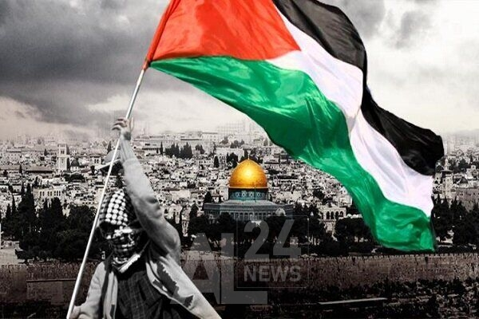

```{r setup, include=FALSE}
knitr::opts_chunk$set(echo = FALSE)
```




Palestine is sometimes called the Holy Land. It is a sacred place for three major religions: Islam, Christianity, and Judaism. 


Palestine is a region in the Middle East. It is in the Levant, between the Jordan River and the Mediterranean Sea. Many cultures have lived in Palestine through history and built their civilizations, such as the Philistines, Phoenicians and Arabs.

The Israeli–Palestinian conflict has its roots in the late 19th and early 20th centuries, with the birth of major nationalist movements among the Jews and among the Arabs, both geared towards attaining sovereignty for their people in the Middle East.
Since 2022, over 600 Palestinians including 150 children had been bombed, shot and attacked due to Israeli forces.

The Gaza Strip and West Bank, including East Jerusalem – has been illegally occupied by Israel since 1967.

Even though this conflict between the two has been going on for many years, people seem to have forgotten the importance of justice that Palestine should have received as they are well deserved of it.  


